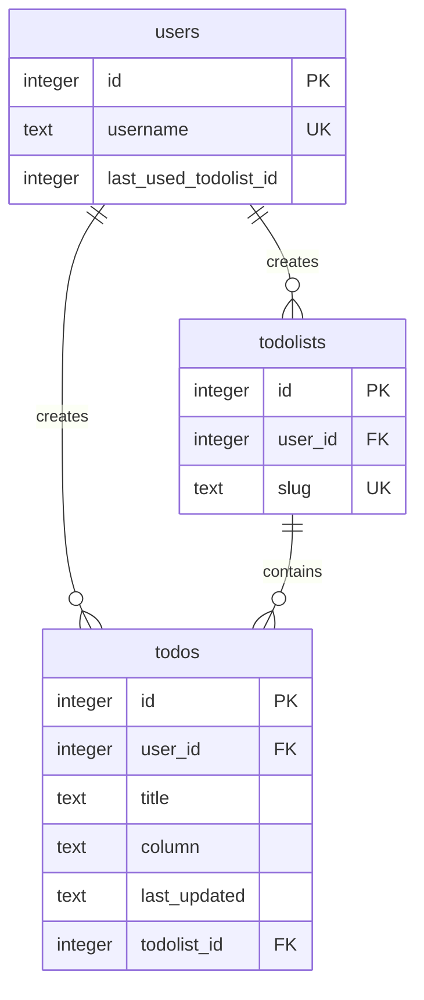

# pooltasks


A project board to track your TODOs.

## Installation

### Server

You can run the backend using `docker-compose`:

```sh
docker-compose up --build
```

By default the server will be exposed through port 8000.

If you don't have `docker-compose` available, you can:

1. Build the Docker image in the `server/` folder and run it: `docker build -t pooltasks . && docker
run -p 8000:8080 pooltasks`
2. Build it with Go: `go mod download && go build . && ./main`

You can verify it's working by hitting the ping endpoint:

```
curl http://localhost:8000/_ping
# => PONG
```

### Client 


You can run the Electron app by running `npm i && npm start` inside the
`client/` folder.

The local state for the application is stored in the appData
folder. You can clean it by runnning `npm prune`, or by removing the
file manually (for macOS it lives in `~/Library/"Application
Support"/todolists-client/user.json`.


## Schema



## Problems

This implementation is not complete. It lacks:

* Joining a new session does not work. The groundwork is there but I
  lacked time.
* macOS/Windows package. Electron Forge creates them with `npm run
  make`, but there's some weirdness re. Vite not building `preload.js`.
* I have not included any unit tests.

## Considerations

Given the nature of the task I took some shortcuts. With more time I
would have worked on these (I'd still use SQLite though).

* I decided to use SQLite instead of something like Postgres or MySQL
  to make my life easier. If running inside Docker, the database will
  be wiped every time the container is stopped.
* The client stores sync data locally in the appData folder. In order
  to run more than one instance of the application, they need to be
  run as different users.
* The packages generated by Electron Forge (`npm run make`) can't load
  content on macOS, and probably Windows.
* Given the requirement to have the server running locally, additional
  instances of the app running on different machines forces the user
  to enter the backend hostname by hand. Ideally this would be handled
  by sharing a deep link instead of only a slug.
* The server code is very light on validations, especifically: it has
  no authentication/authorization. All the endpoints are open to
  manipulation.
* The Electron application needs more tests.
* multistage docker build
* I iterated very quickly on this, and am pretty certain there's dead
  code inside the project.
* The code here is not ARIA-compliant.
* nice chance to learn CRDTs
